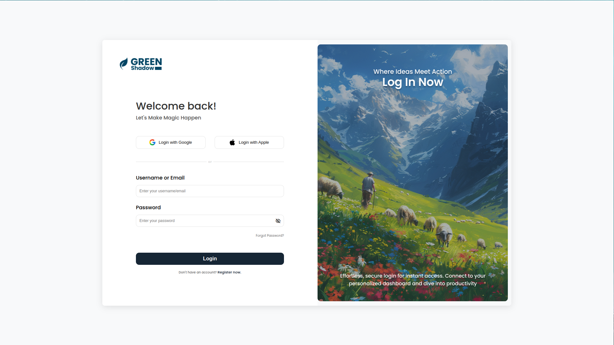
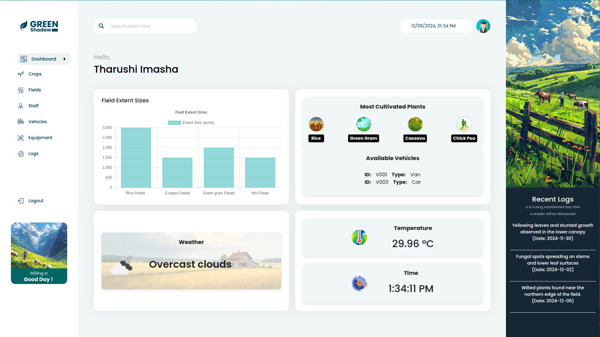
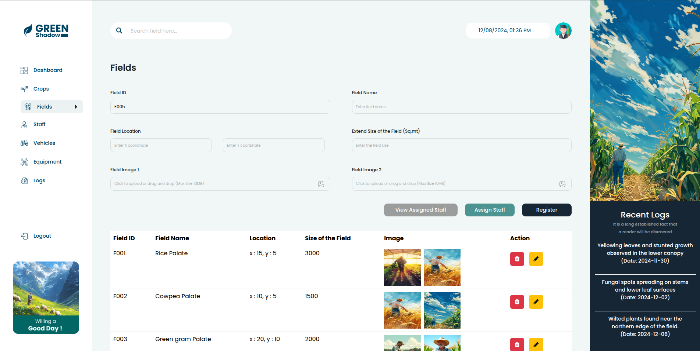
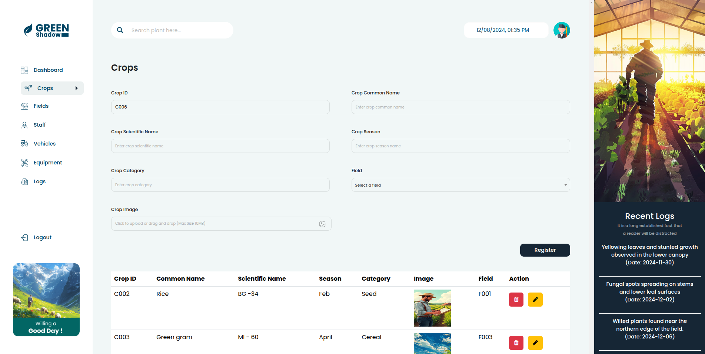

# Crop Management System 🌾

A robust crop management system developed with **Spring Boot** and **MySQL**, featuring advanced security with JWT, seamless field monitoring, and efficient resource allocation for better agricultural practices.

---

## 🚀 Features

- Manage crops, fields, vehicles, equipments, crop details(logs), user, and staff assignments.
- Secure login with **JWT authentication**.
- Transparent field view for better visualization of field data.
- REST APIs for handling field records, staff details, vehicle, equipment details and crop logs.

---

## 🛠️ Tech Stack

- **Backend**: Spring Boot, MySQL
- **Frontend**: HTML, CSS, JavaScript
- **Security**: JWT Authentication

---

## 📷 Screenshots

1. **Login**
   

2. **Dashboard**
   

3. **Field Management**
   

4. **Crop Management**
   

---

## License
This project is licensed under the MIT License. See the [LICENSE](LICENSE) file for details.
